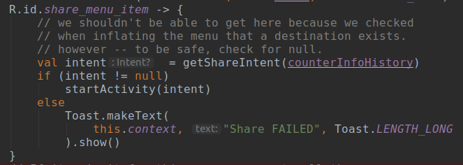

    * Initial draft: Sun May  5 13:55:22 PDT 2019

###About
This app is meant to demonstrate Kotlin, Data-Binding and the Navigation package.  The initial version only implements Data-Binding with a button listener and a text view.

It was written while taking a Udacity course on programming in Kotlin for Android.  At one point I decided to try and implement some of the concepts taught in the class.  After spinning my wheels for about a week I discovered that my problem was that there were changes to gradle that I don't remember covering in the course.

I tried to set up git so it's easy to see what is changed at each step along the way.  What I'd suggest is to clone the repository to a local directory.  Using 'git log' you can see the message for each commit, use 'git diff --name-status' to see what files were changed between commits, and then use git diff on the files to see what changed between files.

**Note:** you need at least AndroidStudio 3.4, Kotlin plugin 1.3.31 and Gradle 5.11 for this app.

This is what I've done so far:

1. Create an initial kotlin android application with an empty activity.  By default this will give you a MainActivity.kt and an activity_main.xml layout.  I removed the android test directories.  This app isn't going to do enough to make their use worth while.
2. Make the basic changes to gradle, MainActivity and activity_main.xml for the basic activity to compile.  This includes adding the <layout> tag to the layout file.  It also involved replacing the constraint-layout (which doesn't support data-binding) with a simple LinearLayout.
  
    After you have completed this step you should see a new package under Android->app->GeneratedJava which will contain a class called ActivityMainBinding.  ActivityMainBinding is a name-mangled version of activity_main and if you examine it you will see static public declarations for each of the view objects in activity_main that are name-mangled versions of their resource ID.  This is the magic of name-mangling: you no longer need to go through the process of finding each view using 'findViewById' and you get compile-time handles for each view object rather than waiting for runtime handles.

3.  Add a button listener to the MainActivity.  Here you will 
see the use of data-binding in the onCreate method.

4.  Add an "About" menu item that will display build timestamp, branch, build type, etc.

    * Changed app/build.gradle to add info to BuildConfig.
    * created res/menu/menu_main.xml.
    * Added menu inflator and listener callback to MainActivity.
    * Added an AlertDialog to MainActivity for displaying the menu info.
    * Create an app/src/main/res/navigation directory and add to it a navigation.xml resource file.  The NavigationEditor (later) will save it's actions here.

5.  Create fragments for navigation.

    * Add implementation dependencies for navigation-fragment-ktx and navigation-ui-ktx to the app/build.gradle.
    * Add fragments for navigation demo.  For each of these, create both a ...Frag.kt fragment class and ...frag_.xml layout file.  Each will have one or two buttons to demonstrate data-binding for callbacks and navigation.  You have to add the <layout> wrapper to each of the xml files to enable data-binding.

        * RootFrag.kt and root_frag.xml has two buttons with id's: to_upper_frag_btn and to_lower_frag_btn
        * UpperFrag.kt and upper_frag.xml which has one button with an id of to_top_from_upper_button.
        * LowerFrag.kt and lower_frag.xml which has one button: to_top_from_lower_btn
        * TopFrag and top_frag.xml which has one button: to_root_btn.

    * Compile the code.  This will fail for the *Fragment.kt files but will generate the *FragBinding.java files for data-binding.
    * Edit each of the Frag.kt files.  Your goal is to get the onCreateView method working and hook up the basic data-binding code.  We aren't worried about the button event handlers yet.  When everything compiled I checked in the code.
    * Open the res/navigation/navigation.xml layout.  In design mode this will bring up a graphic Navigation Editor that is used to define the action relationships for each fragment.
.
        * In the upper-left of the Navigation Editor there is a small icon that looks like a phone.  Use this to add each of your 4 fragments.
        * Drag them to appropriate locations.
        * use the graphic editor to "connect the dots".  **Note** that the **"Pop Behavior"** has a checkbox that says "Inclusive.  **Inclusive means "pop until you find the fragment and pop that too."  Non-inclusive means "pop until you find the fragment, then stop."**  Define these action relationships:

            * root -> upper frag
            * root -> lower frag
            * upper frag -> top frag
            * lower frag -> top frag
            * top frag -> root frag
            
        

        * This is how the Navigation Editor looked to me at this point.  **Yours may look different.**  The layout for the editor is in .idea/navEditor.xml which is not under git control.

6.  Next we will add onClick listeners to each of the fragments using the NavGraph created by the navigation editor.  If you look at res/navigation/navigation.xml we created, you will find it now contains a <Fragment> for each of the four fragments we added.  Each <Fragment> contains an action or actions that were defined by the connections were made.  Syntax for the resource id for the action is "action_<Fragment>_to_<destination Fragment>.  For instance the action from the rootFrag to the upperFrag is "action_rootFrag_to_upperFrag".  

     We have two ways we can use setOnClickListener.  As far as I can tell, it doesn't make much difference which is used.  The thing to note is that both use the navigate method which is of note because this method deals with adding/removing from the  back stack which means that we can use the back arrow without any further coding.

    * assign a lambda:  
      *view -> view.findNavController().navigate(action resource id)*
    * use the Navigate class to create our onClick:  
      *Navigation.createNavigateOnClickListener(action_resource_id, null)*

7. Enable the "up" button in the action bar.  In theory, this is simple:  all you have to do
   is over ride the onSupportNavigateUp method.  **HOWEVER**  -- there is a possible got-ya here.
   We added a menu item above.  When you implement the "up" button "->" is pressed, for some reason
   the onOptionsItemSelected method is called.  If you implemented this to return true, the
   onSupportNavigationUp method will never be called.  **You must implement the 
   <u>onOptionsItemSelected</u> method to return false if it doesn't recognize
   the menu item passed in or onSupportNavigationUp will never be called and
   the up button will not work!**

8. Extend menu to fragments:  This turned out to be easier than expected.
   I created a res/menu/menu_&lt;frag name&gt;.xml for each fragment and
   over rode onCreateOptionsMenu and onOptionsItemSelected in each fragment
   class as well as adding setHasOptionsMenu(true) to each Fragment class'
   onCreateView.  There was already an onCreateOptionMenu and
   onOptionsItemSelected method in the MainActivity class.  Then each
   class checked the item id passed into the onOptionsItemSelected and 
   the item wasn't for the class, it called it's super class.  As I had hoped,
   the activity and fragments each received their items.

9. **Safe-args**: I added a fragment to display the counter info to demonstrate
   use of safe-args.

    * Make changes to build.gradle and app/build.gradle to pull in changes
      necessary for safe-args.
    * add counter_info_frag.xml using new->layout resource file.  This will
      be a text-view inside a scrolled view because scrolled text-view doesn't
      seem to work in Fragments.  Wrap the scroll view in a <layout> tag so we
      can use data-binding.  The resource id for the scroll view is counter_info
      layout and for the text view is counter_info_tv.
    * add CounterInfoFrag.kt as a new Fragment.  You don't want any options checked when
      you create this class file.
    * add counter_info_frag to the Navigation Editor.  Select it and show two arguments:
      a long called called counterChangeTimestamp and an integer called counter.
      Both will have initial values of zero.  Rebuild will result in several new
      generated files ChangeInfoFrag*.java that contain your data-binding info and also
      the interface code for safe args.  ChangeInfoFrag is a name-mangled version of
      change_info_frag.xml.
        * CounterInfoFragBinding contains the data-binding interface.
        * CounterInfoFragArgs is used by the fragment creator to build a bundle for
          the fragment and used by the fragment to extract the user arguments from
          the bundle.
        * CounterInfoFragDirections has the action directions used for navigating
          to another fragment on the navigation graph.  It can also be used for
          creating the bundle for the destinatino fragment.
    * Modify the MainActivity button listener to invoke the CounterInfoFrag.  
        I ended up creating a bundle and passing it because I'm just invoking the 
        fragment from the activity instead of from another fragment.  You will
        notice also in the 'up button' callback I'm poping the CounterInfoFrag
        if it's next.  I wanted the counter button to work if the info frag was
        visible but if the back button is used from the counter info frag, it
        should not go back to itself.  Since this is not a 'directed' fragment
        (i.e. one frag to another) I had to do this in the callback.
    * Modify ChangeInfoFrag.kt to display the info.ca000e0caf7005b0ed4deefb03f02c74e2799275
        
10. Adding "Share"ability to the counter info page to demonstrate use of intents.

    * You will need to add a new menu resource file for the CounterInfoFrag fragment
      file.  I copied one of the other menu/menu*_frag.xml files, changed the title
      to i_am_counter_info_frag_item and changed the title to "I AM COUNTER INFO".
    * You will need to add the menu inflater and the event listener.  I copied the
      code for onCreateOptionsMenu (the inflator) and onOptionsItemSelected (the 
      event listener) from one of the other *Frag.kt files.  Change the switch
      statement in the event listener to R.menu.i_am_counter_info_frag_item to
      correspond to the changes in the menu.xml file. Your code should now 
      compile and run and you can select the COUNTER INFO menu item and
      see a toast message.
    * Now add a new item to menu_counter_info_frag.xml:
    
        &lt;item  
            android:id="@+id/share_menu_item"  
            android:title="@string/share_str"  
            app:showAsAction="ifRoom"  
            android:icon="?attr/actionModeShareDrawable"  
        /&gt;  
    
    By coincidence, I happened to select the shared icon from the theme using the
    design editor (hence ?attr/).  The interesting thing about this icon and the
    theme is that when the menu item is disabled, the icon is dimmed but still
    visible.  Later I will use this by disabling the menu item when the shared
    feature is unusable.
    * Build your code and run your code.  After you click on the 
    increment counter now, you should see a share icon on the tool bar.
    Click on the icon and you should see a toast message that says share.
    Assuming this works, you are ready to add the intent code.
    
        * Creating the shared intent:  
        We want to send an message to applications that will respond to "text/plain"
        which will mean things like email, social apps, etc.  This involves building
        an intent and using startActivity to invoke the other application.
          
        This code builds the intent for the text passed in and then attempts to resolve
        it.  If resolution fails (i.e. no application responds to this mime type) we
        set the returned intent to null.
        * enable/disable menu item in onCreateOptionsMenu  
          
        The code in the onCreateOptionsMenu method tests to see if an app supports
        the mime type by trying to get an intent with an empty string.  If the
        resultant intent is a null we disable the menu item.  With the menu item
        disabled, the user sees a greyed-out icon and can't "share" his counter info.          
        The code with 'isEnabled' was confusing to me on first encountering it.  It's 
        the same   
        *shareItem.setEnabled(getShareIntent("") != null)*  
        and is refered to as "property access syntax" in kotlin.
    
        * Sending the intent:  
          
        The code above gets an intent and if it's not null broadcasts it using 
        the startActivity method.  
        
    * That's it, you just 'shared' your counter info.
    

    
    
    
